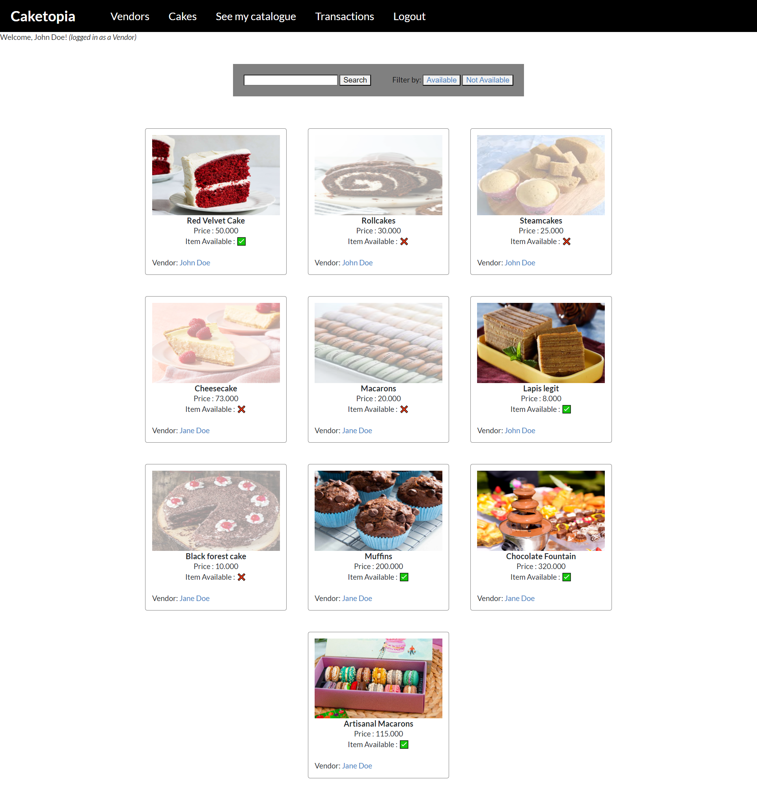

# Caketopia Express App

Example CRUD application created using Express.js.

Caketopia is a web application for cake lovers and cake artisans to buy and sell their services. By signing up on the application, customers can place orders on cake services advertised on the website that will be processed directly by the sellers. In addition, customers can chat directly with the sellers through real-time chat.

## Tech Stack & Features
 - Express.js 
 - User authentication & session storage using Express Session Middleware
 - HTML code rendered server-side using EJS templates (no front-end code)
 - ORM Sequelize
 - PostgreSQL Database
 - Real time chat application made using Socket.io

## Setup project

```npm install```

Installs all packages & dependencies

```bash dbsetup-sequelize.sh```

Creates, migrates and seeds the database used by the application (Default name of database: `caketopiaDB`). [Requires sequelize-cli]

```npm run dev```

Runs the web application on http://localhost:3000

```bash dbdrop-sequelize.sh```

Drops the database used by the application. [Requires sequelize-cli]

## Demo



### Real Time Chat using Socket.io

